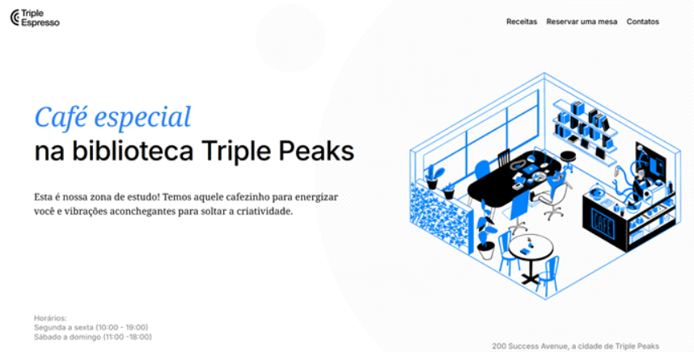
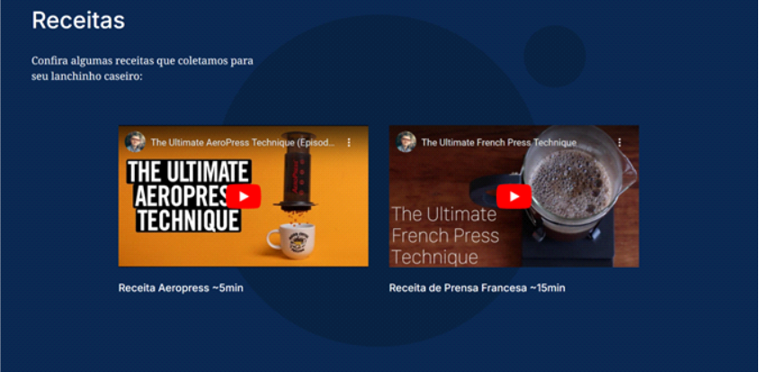
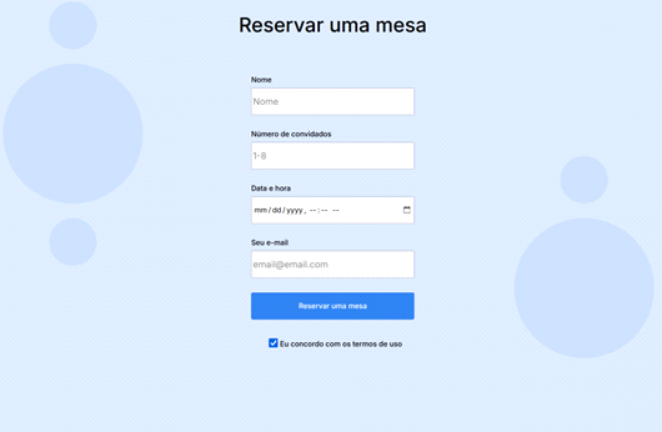
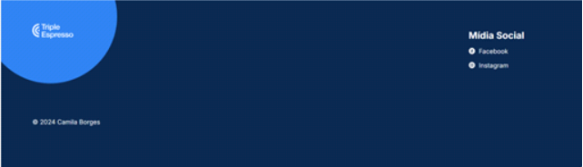

# Projeto: Cafeteria

<h1 align="center">

<a href="https://borges-camila.github.io/web_project_coffeeshop/">Abrir aqui</a>

  
  
  
  
</h1>
 
- Projeto desenvolvido com o objetivo de elaborar um website para uma cafeteria, onde existem vídeos com receitas e um formulário de reserva de mesas.

## Tecnologias

- Projeto elaborado utilizando HTML e CSS, sendo este responsível aos tamanhos de tela mobile, tablet e desktop;

## Ferramentas

    <a href="https://reactjs.org/" target="_blank" rel="noreferrer">

## Apredizados

- Elaboração de formulários
- Inserção de vídeos do YouTube.

## Melhorias

- Implementar a responsividade, para que o site se adapte a diferentes tamanhos de tela.

## Como utilizar

- Você pode clonar o repositório
- Abrir o arquivo index.html
